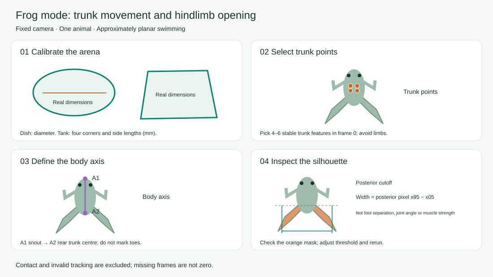
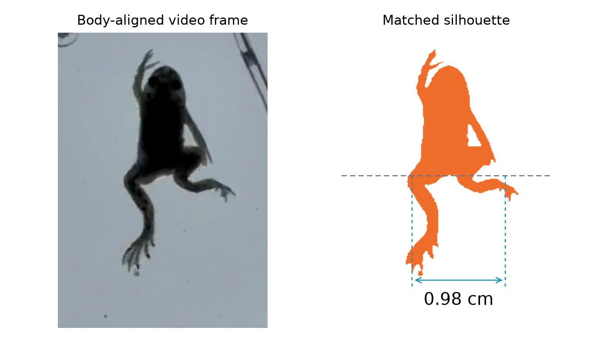
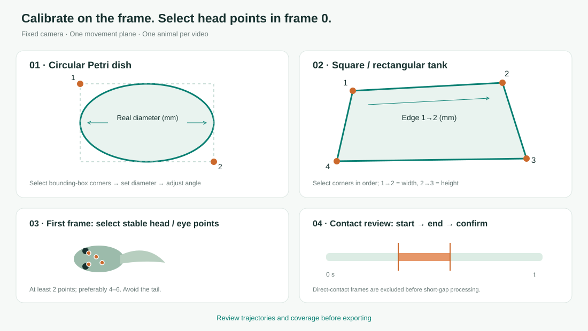

# Swim Studio: visual swimming analysis

## Two animal modes (v1.3.0)

Desktop applications include the runtime and model; Python setup below applies only to the source launchers.

- **Tadpole:** select 4–6 stable head/eye points in frame 0.
- **Frog / froglet:** select 4–6 stable central trunk points, avoiding limbs. With **Body axis**, mark the snout and rear trunk centre in that order.
- Hindlimb measurement is enabled by default; disable it for locomotion only. Choose dark or light foreground, adjust the grayscale threshold and crop width in body lengths, then review the orange posterior mask.
- Additional outputs: `10_frog_hindlimb_silhouette.tsv`, `10_frog_hindlimb_spread.pdf/png`, `11_frog_hindlimb_mask_review.png` and `frog_hindlimb_QA.mp4`.
- Spread range is the valid-frame P95−P5 width, not cycle amplitude or frequency. Recomputing silhouettes requires the original video; cache-only runs explicitly report when it is unavailable.
- Switching animal mode resets points. Existing projects without a mode remain tadpole projects.



Enter `0.3, 0.5` under **Snapshots at chosen times** to export original frames, paired video/silhouette panels, separate silhouette PNG/PDF figures and a snapshot manifest. The hindlimb CSV/TSV contains time, frame number, width in mm and cm, and validity. Untracked or invalid frames retain missing measurements.



Same-frame measurement example. Its value uses the example calibration; each project is measured using its own frames and calibration.


[中文说明](GUI_GUIDE_CN.md)

## Launch from source

Extract the complete distribution to a writable folder. Install **Python 3.11–3.13 (3.12 recommended)** first; on Windows select “Add Python to PATH”. Double-click `launch_windows.bat` on Windows or `launch_mac.command` on macOS. The launcher creates an isolated environment, installs analysis dependencies on the first launch and opens your default browser. Keep its terminal window open; press Ctrl+C there to exit.

This section describes the source launchers. GitHub Release desktop applications include Python and the model. Videos are copied into `gui_workspace` on your own computer. No video is uploaded to a cloud service. Internet access is used for initial package/model downloads. If the Mac script is not executable, run `chmod +x launch_mac.command`; alternatively run `python3 bootstrap_gui.py`. If you move the app and its environment stops working, recreate only `.venv-gui`; project data lives separately in `gui_workspace`.

## Visual guide



## Workflow

1. **Try the demo.** Load the included audited trajectory cache and click Run analysis. No raw video or model download is required.
2. **Import your video.** MP4, MOV, AVI, MKV and M4V are accepted when OpenCV can decode them. Resolution, frame count and encoded FPS are detected automatically. One animal per video.
3. **Calibrate.** For a dish, click two opposite corners of its ellipse bounding box, enter the real diameter and adjust angle/reselect the outline as necessary. For a tank, select top-left, top-right, bottom-right and bottom-left in order; enter the actual lengths of edges 1→2 and 2→3. All dimensions are **mm**, measured in the plane of movement. Confirm the calibration checkbox after checking the outline.
4. **Select tracking points.** The Head points tool returns to frame 0. For tadpoles select 4–6 stable head/eye features. For frogs select central trunk features and the two body-axis landmarks described above. Undo, reset and zoom are available. A crop must include the entire movement area.
5. **Review timing and contact.** Leave Acquisition rate empty for ordinary videos. For slow motion, enter the actual capture FPS. Adjust sampling, model size, device and advanced settings as needed. Mark intervals of direct rod/forceps contact using frame stepping or entered times. Confirm reviewed intervals, including an empty list if there was no contact.
6. **Run.** Desktop users can start analysis directly. When using the source launcher, use Prepare tracking model once to install PyTorch, fetch pinned CoTracker3 and verify its weights. CPU is the portable default; GPU support depends on the environment. Run analysis, inspect coverage/trajectories/QA video and export the result ZIP. Saved projects reopen with their completed results. Export/import settings to reuse a calibration on a matching recording.

## Parameters and outputs

- **Acquisition FPS** changes the timebase, speed and windows specified in seconds. Contact annotations with raw-frame indices are converted to that timebase; review imported time-only tables yourself.
- **Track every Nth frame** trades temporal detail for processing cost. **Model input size** changes tracking resolution, not physical scale.
- **Advanced settings** expose visible-point/spread thresholds, excluded point IDs (**1-based**, e.g. `2, 5`), smoothing, interpolation, speed cutoff and stimulus grouping gap.
- **Acquisition notes** record camera, shutter, exposure, lighting or water depth. The application does not control camera hardware.
- **Whole-video mean speed** retains the original definition: strict distance divided by last sampled-frame time. A separate mean over analyzable steps is exported in the tables. Inspect analyzable-frame coverage before interpretation.
- Contact frames are excluded before short-gap processing; the recorded interpolation rules still apply. The post-stimulus window remains 2 s.
- The ZIP contains TSV tables, PDF/PNG figures, optional QA video, configuration, package versions, hashes and `replay/` inputs for cache-only reproduction. Tables and plot labels remain in English; the UI and guide are bilingual.

## Scope and compatibility

Use a fixed camera with one animal moving approximately in a plane. The dish transform is an ellipse-to-circle affine approximation; tanks use a four-point planar homography. Neither corrects refraction, water depth, lens distortion or out-of-plane motion. Multi-animal identity tracking and camera motion correction are not implemented.

Legacy JSON retains the original ellipse QC rule. New ellipse configurations use rotation-aware QC. The frozen demo metrics are regression-tested. See [validation record](docs/VALIDATION.md) for what was actually tested; cross-platform launchers/CI do not imply every Windows device or GPU was tested.

CoTracker uses **CC BY-NC 4.0**; see [THIRD_PARTY_NOTICES.md](THIRD_PARTY_NOTICES.md).

## Troubleshooting

- **Codec failure:** export a constant-frame-rate H.264 MP4. The current timebase assumes constant FPS; a file extension alone does not identify its codec.
- **Model setup fails:** check internet access and Git (Git for Windows, or macOS command-line developer tools). Interrupted temporary source downloads can be retried.
- **GPU unavailable:** select CPU. CUDA requires compatible PyTorch/drivers; MPS requires a supported Apple GPU/system.
- **QA MP4 will not play in the browser:** download it to a desktop player. Plots and TSV files remain available.
- **Installation error:** inspect the launch window and check Python version, free space and package-source connectivity.

## Tests

```bash
python tests/test_gui_analysis.py
python tests/create_synthetic_video.py .gui_test_workspace/synthetic.mp4
# Install Playwright in a development environment, then:
python tests/run_ui_tests.py
```

The synthetic target is a software smoke test, not a biological accuracy benchmark. `requirements-lock.txt` preserves the original v1.0 environment; `requirements-gui.txt` supplies portable version ranges and every analysis records resolved versions.
