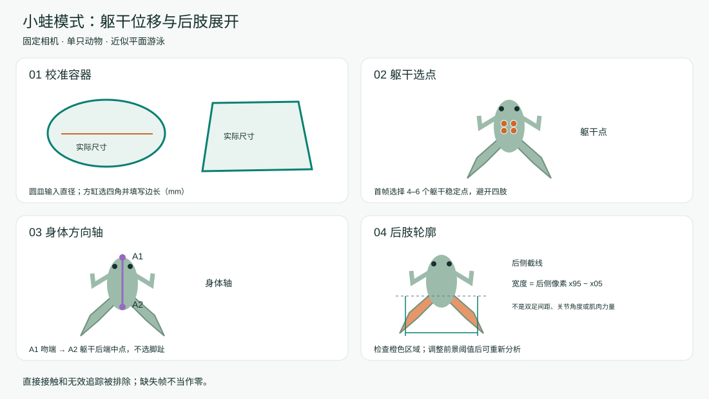

# Swim Studio

用于**蝌蚪和小蛙／蛙**的本地游泳视频分析，提供中英文界面。导入视频前选择相应模式。

[English](README.md) · [Mac、Windows 程序及源码](https://github.com/Youweichen9155/Swim-Studio/releases/latest) · [详细操作指南](GUI_GUIDE_CN.md)

| 模式 | 首帧选点 | 输出 |
| --- | --- | --- |
| **蝌蚪** | 头部／眼睛上 4–6 个稳定点 | 游泳距离、速度和轨迹 |
| **小蛙／蛙** | 躯干中央 4–6 个稳定点；吻端和躯干后端两个身体轴点 | 躯干参考位移、速度、后肢轮廓展开／收拢曲线 |

## 操作步骤

1. 选择分析模式，导入单只动物的视频。
2. 选择容器形状，标记轮廓或四角，输入实测尺寸（mm）。
3. 在首帧选择头部点或躯干点；小蛙再用“身体轴选点”依次标记吻端、躯干后端中点。
4. 核对实际拍摄帧率，人工标记直接刺激接触区间；无接触时勾选确认。
5. 开始分析，检查轨迹。小蛙还需检查橙色后肢分割区域，必要时调整前景阈值后重新分析。
6. 导出逐帧数据、曲线图、参数和检查视频；保存项目后可继续使用。

### 蝌蚪操作示意

### 小蛙操作示意

后肢指标为身体方向校正后，后侧轮廓像素横坐标的 **第 95 与第 5 百分位之差**，反映后肢区域展开与收拢，不代表双足间距、关节角度或肌肉力量。分割失败、方向点不可见或直接接触的帧不生成后肢测量值；同时查看轨迹和后肢的有效帧比例。

固定相机拍摄，确保动物近似在同一平面内活动。本版本不校正相机移动。后肢分析要求动物与背景有清楚的明暗对比；反光、透明体色或肢体重叠可能影响分割。组间比较应使用一致的设置和观察时窗。

## 程序与文件

发布页提供 macOS Apple Silicon（macOS 15 及以上）、Windows x64 程序及源码；桌面版内置运行环境和模型，当前未签名。源码运行方法见[操作指南](GUI_GUIDE_CN.md)。

视频在本机处理；仓库不包含原始实验视频。附带示例仅为去标识的蝌蚪追踪缓存。CoTracker3 遵循 **CC BY-NC 4.0**，使用须符合非商业许可条款。
