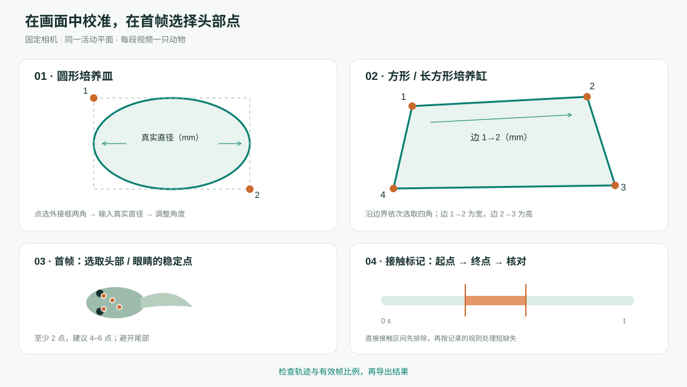

# Swim Studio：游泳行为可视化分析

用于单动物视频的本机分析程序。支持培养皿和方形培养缸校准、头部选点、刺激接触时间排除、中英文切换，以及距离、速度和轨迹结果导出。

[English](README.md) · [下载页面](https://github.com/Youweichen9155/Swim-Studio/releases/latest) · [简短使用说明](DESKTOP_QUICKSTART.md)

## 下载后直接使用

| 系统 | 下载 | 解压后打开 |
| --- | --- | --- |
| Mac：Apple Silicon，macOS 15 及以上 | [Mac 版](https://github.com/Youweichen9155/Swim-Studio/releases/download/v1.2.0/Swim-Studio-1.2.0-macOS-AppleSilicon.zip) | `Swim Studio.app` |
| Windows：64 位 | [Windows 版](https://github.com/Youweichen9155/Swim-Studio/releases/download/v1.2.0/Swim-Studio-1.2.0-Windows-x64.zip) | `Swim Studio.exe` |

**运行环境、模型和权重均已内置，无需安装 Python，也无需首次联网下载模型。** 完整解压文件夹；Windows 版须保留 `_internal` 文件夹。启动后会自动打开本机浏览器中的界面，分析期间保留启动窗口。

目前安装包未使用发布者证书签名或公证，首次打开可能出现系统来源验证提示。Mac 包适用于 Apple Silicon，不适用于 Intel Mac；Windows 包使用 CPU 追踪。

## 操作流程

1. 导入每段只有一只动物的视频。
2. 选择圆皿／椭圆或方形培养缸，点选轮廓或四角，填写真实尺寸。
3. 在首帧头部／眼睛选择 4–6 个稳定点。
4. 人工标记玻璃棒或镊子直接接触动物的起止时间；没有接触则确认无接触。
5. 开始分析，检查轨迹和检查视频，导出结果。

可调整拍摄帧率、追踪间隔、输入尺寸、裁剪及质控参数。导出内容包括表格、PDF/PNG 图、参数、接触区间和溯源信息。视频在本机处理。

## 源码与验证

源码可直接浏览，也可从 Release 下载。源码运行需要 Python 和依赖；上方独立应用无需这些准备。

- [详细中文指南](GUI_GUIDE_CN.md) · [验证记录](docs/VALIDATION.md)
- [命令行和原始数值复现](CLI_REFERENCE_CN.md) · [打包说明](BUILDING.md)

示例只包含去标识化的追踪坐标与人工接触区间，不含原始实验视频。CoTracker3 模型使用 CC BY-NC 4.0 许可，包含非商业使用限制；详见[第三方说明](THIRD_PARTY_NOTICES.md)。
